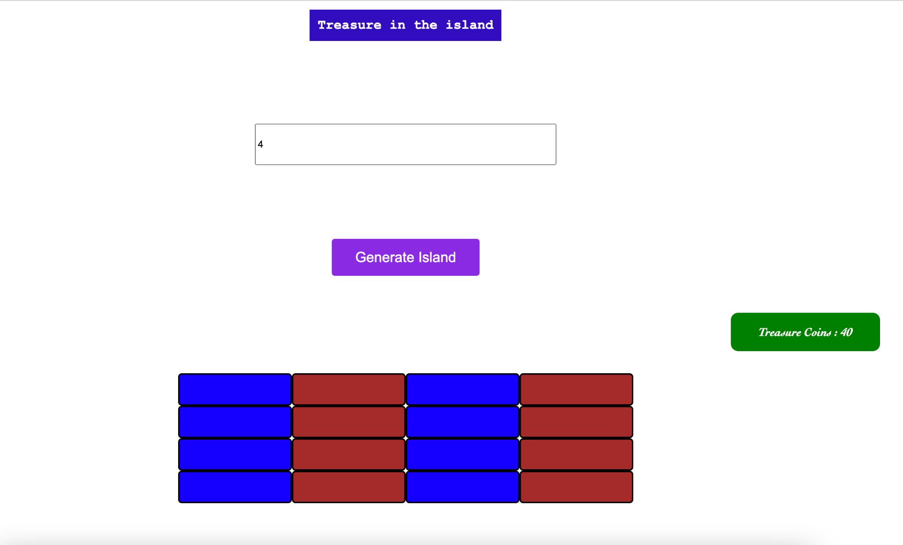

# Getting Started with the game

Run `npm install` and then 
Visit the ${current-folder-location}/index.html

## Game rules

On entering the number of rows you will see the island with the same number of rows and columns

You will see 

Choose the island cells and get clues to find Treasure. Coins will be minimized for wrong guess. Look at right treasure coins tab to know coins left. 

## You will win

If you find the treasure before you lose all coins and the coins left is equivalent to the value of treasure you found

## You will lose

If you do not find the treasure before you lose all coins 

